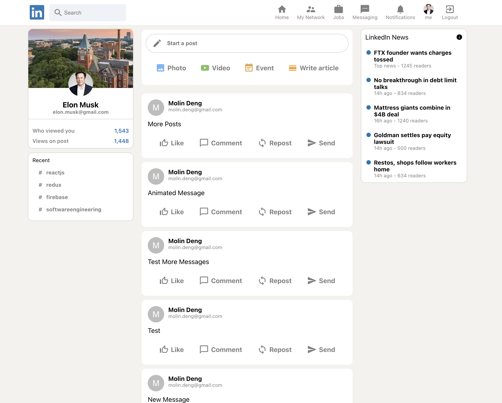

# LinkedIn Clone Web App

This project was bootstrapped with

* [React](https://react.dev/) (Redux template)
* [Redux](https://redux.js.org/) & [Redux Toolkit](https://redux-toolkit.js.org/)
* [MUI](https://mui.com/core/) (UI icons & UI componentes)
* [Firebase V9](https://firebase.google.com/) (Firestore database & authentication & deployment)
* [react-flip-move](https://github.com/joshwcomeau/react-flip-move) (Animation)

visit and have fun with <https://linkedin-clone-1cfda.web.app/>

## Features

* LinkedIn-like UI style (light mode)
* Responsive layout
* Account management (register/login/logout)
* Sending Posts
* A bit of animation

## Getting Started

In the project directory, you can run:

#### `npm install`

Installs all the dependencies.

#### `npm start`

Runs the app in the development mode.\
Open [http://localhost:3000](http://localhost:3000) to view it in your browser.

The page will reload when you make changes.\
You may also see any lint errors in the console.
